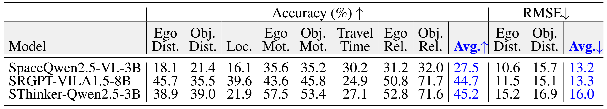

  <h1>Ego3D-Bench: Spatial Reasoning with Vision-Language Models in Egocentric Multi-View Scenes</h1>

  

  <a href="https://arxiv.org/abs/your-paper-id" target="_blank" style="background-color: #2e2e2e; color: white; padding: 0.5em 1em; border-radius: 2em; text-decoration: none; font-size: 1em; display: inline-flex; align-items: center;">
    ✂️&nbsp; arXiv (Comming Soon!)
  </a>

  <a href="https://github.com/yourusername/yourrepo" target="_blank" style="background-color: #2e2e2e; color: white; padding: 0.5em 1em; border-radius: 2em; text-decoration: none; font-size: 1em; display: inline-flex; align-items: center;">
    🐱&nbsp; Code (Comming Soon!)
  </a>

  <a href="https://huggingface.co/datasets/yourdataset" target="_blank" style="background-color: #2e2e2e; color: white; padding: 0.5em 1em; border-radius: 2em; text-decoration: none; font-size: 1em; display: inline-flex; align-items: center;">
    🤗&nbsp; Dataset 
  </a>

  

  <h2>Abstract</h2>
Understanding 3D spatial relationships remains a major limitation of current1 Vision-Language Models (VLMs). Prior work has addressed this issue by creating spatial question-answering (QA) datasets based on single images or indoor videos. However, real-world embodied AI agents—such as robots and self-driving cars—typically rely on ego-centric, multi-view observations. To this end, we introduce Ego3D-Bench, a new benchmark designed to evaluate the spatial reasoning abilities of VLMs using ego-centric, multi-view outdoor data. Ego3D-Bench comprises over 8,600 QA pairs, created with significant involvement from human annotators to ensure quality and diversity. We benchmark 16 SOTA VLMs, including GPT-4o, Gemini1.5-Pro, InternVL3, and Qwen2.5-VL. Our results reveal a notable performance gap between human level scores and VLM performance, highlighting that current VLMs still fall short of human level spatial understanding.
  

  <h2>Leaderboard on Ego3D-Bench</h2>

  <h4>Generalist VLMs</h4>

  

  <h4>Spatial VLMs</h4>

  

